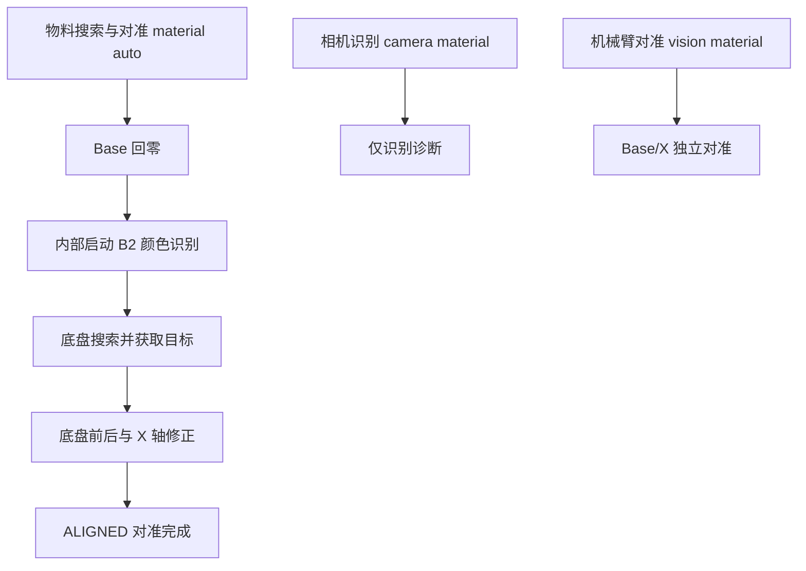

# 八千代控制台改版与二维码接入方案

日期：2026-09-12  
状态：本轮软件实施完成；主机回归及 Keil 构建通过，实物验证待作者完成。实际交付见文末实施记录。

配套设计：[八千代控制台 UI 布局细化](2026-09-12八千代控制台UI布局细化.md)。页面空间、导航和交互以该细化文档为准，命令含义与二维码接口以本文为准。

**目标：** 将现有本地串口网页整理为八千代主题的智能搬运控制台，让常用操作直接可见、任务与调试有明确层次，并接入现有二维码模块的任务码信息。

**架构：** 保留原生 HTML/CSS/ES Modules、Web Serial 和 Python 本地服务。网页仍通过 USART1 控制台与 STM32 通信；任务执行由 STM32 负责。网页命令分类与固件协议分别维护，不用网页按钮数量决定固件接口是否删除。

**实施方式：** 按第 11 节逐项实施并独立验证；后续实现可使用 executing-plans 工作流。二维码固件扩展单独交付，避免把界面重排与硬件行为变化混在一个步骤里。

**前置依赖：** 作者正在实施《本车底盘控制与二维地图对齐修改计划》。该任务先交付底盘通信、运动任务和地图遥测的可集成版本及测试结果，再实施本方案代码。本轮仅修改这两份规划文档，不与该任务并行编辑网页或固件。后续二维码回复与事件必须接入它完成的非阻塞发送管理，复用单一串口连接与遥测分流，不另建发送机制。

## 1. 需求理解与本轮边界

### 1.1 已明确的要求

- 人物使用作者提供的八千代原图 `assets/parasol-original.png`，完整保留，不重绘；旧人物素材已删除，不恢复。
- 将“晴空工坊”改为与八千代有关的新名称。
- 移除“小车实验室”等装饰小字，不再沿用原来的实验室叙事。
- 英文与 2027 年工训/工创智能搬运赛事相关。
- 开发板展示名称逐字使用：**立创·天空星STM32F407VxT6开发板**。
- 保留“指令工作台”这一主体设计；减少大下拉列表，将使能、失能、读取状态等常用操作直接列出。
- 梳理视觉功能之间的包含与并列关系；将早期单模块测试移到调试层。
- 新增二维码摄像头页面能力。
- 为作者后续完善比赛业务预留清晰位置，但不提前把尚未完成的能力显示成可用。

### 1.2 本轮不扩大的范围

不发布网站、不引入账号或云服务、不更换前端框架。保留现有串口连接、日志、收藏、手动命令及轨迹地图。改版方案不包含完整比赛调度器、自动抓取放置流程、路径规划、浏览器视频流或二维码模块参数配置。

本方案中的“从主界面移出”通常是界面重分类，不等于从固件删除。删除固件命令必须另行核对调用、测试及实物用途。

## 2. 代码核查结果与资料依据

### 2.1 当前工程事实

| 核查位置 | 当前事实 | 对改版的影响 |
|---|---|---|
| `upper-computer-web/local-car/protocol.mjs` | 机械臂、夹爪、底盘、视觉、系统五组；视觉将识别、对准、标定、组合任务并列 | 命令字符串可以保留，显示结构需要重排 |
| `app.mjs` | 使用 `sky-atelier-v1` 存储主题、背景、收藏；已有地图接入 | 品牌改名不能直接换存储键导致设置丢失，也不能覆盖地图逻辑 |
| `template/App/arm_console.c` | 当前仍是 ASCII 命令控制台，有 `camera`、`vision`、`material`、`imu` 等入口 | 以当前代码为准，不套用旧 `sys.ping#` 文档 |
| `template/App/MaterialVision.c` | `MaterialVision_Start()` 启动 Base 回零；后续内部调用 `Camera_MaterialStart()`，底盘搜索并与 X 轴配合对准 | `material auto` 已包含相机请求，网页无需先额外发 `camera material` |
| `template/App/ArmVision.c/.h` | `vision material` 是 Base/X 对准，当前接受 `ALIGN_ONLY` | 与底盘/X 对准是两种执行路径，不应全部叫“物料对准” |
| `template/Hardware/Camera.h` | 当前使用 B2 颜色识别，编号 1～6；旧 B3 圆环 API 不可用 | 用颜色名称和编号展示，隐藏旧圆环功能 |
| `template/Hardware/QR.c/.h` | 解析 15 字符 `DDD+DDD+DDD+DDD`，CR 结束，忽略 LF；数字格式允许 0～9 | 格式有效不等于比赛语义有效，不能直接套成两组码或强制所有数字为 1～3 |
| `template/Core/Src/main.c` | 主循环调用 `QR_TaskCodeGet()` 消费新任务码，更新串口屏/OLED；目前选择第二组中的一个数字给颜色识别使用 | 新网页查询必须非消费式，不能抢走主循环的新任务码 |
| `template/Core/Src/usart.c` | 二维码 UART4、PC10/TX、PC11/RX，当前配置 115200、8N1 | 网页通过 STM32 转发状态，不额外占用二维码串口 |
| `template/App/chassis_telemetry.c`、`chassis_motion.c` | 工作区已有新增底盘任务、遥测与反馈接口 | 必须兼容已有地图及新任务入口，不能只按旧网页目录重建 |

另有两项会影响产品文案的事实：

1. 当前 `material auto` 的终点是 `ALIGNED`，没有完整抓取、运输、放置闭环。因此拟标为“物料搜索与对准”，不标为“一键完成搬运”。`MATERIAL_VISION_TEST_NO_TIMEOUT=1` 还表明该模块处于测试设置；网页不能因此展示“比赛流程已就绪”。
2. `main.c` 收到二维码后会给串口屏设置 `CONTEST_SCREEN_RUNNING`，但接收到二维码本身不能证明完整比赛任务已经开始。网页应显示“已接收任务码”，不直接照搬“比赛运行中”。

### 2.2 QDrive 的参考方式

已通过浏览器实际查看 [QDrive Motor 页面](https://www.qdrive.com.cn/tools/web-host/motor/)：它将连接与查询、终端/波形、控制与配置分区，使能、失能、读取状态、读取参数是独立按钮。

本项目借鉴这套操作层次：常用按钮直达、参数输入靠近对应操作、状态靠近受控对象。它的电流模式、速度环 PID、角度环 PID、保存、重启及升级能力不直接复制；必须由本项目固件真实能力决定。

### 2.3 赛事名称与届次

作者提出“2027 年第 9 届”。核查到的 [南京航空航天大学官方通知](https://aao.nuaa.edu.cn/2026/0818/c11066a408512/page.htm) 同时列明：全国赛为 **2027 年第十届**，江苏省赛为 **2027 年第九届**。目前不能据此认定作者参加的是江苏省赛。

第一版英文采用 **INTELLIGENT MATERIAL HANDLING · 2027**，不写届次。它是界面描述性英文，不宣称为组委会官方译名。若作者确认省份和赛事全称，再补充准确届次；赛事身份不影响本轮布局和指令整理。

## 3. 八千代主题与文案

### 3.1 名称选择

| 候选 | 特点 | 建议 |
|---|---|---|
| **八千代·巡航** | 同时关联角色与移动小车，名称短、适合左上角 | 本方案默认 |
| 八千代·调度台 | 工具属性更直接，适合偏比赛任务管理的版本 | 备选 |
| 千代行 | 更简洁，但角色识别和用途说明较弱 | 暂不采用 |

名称是本项目的原创命名提案，不虚构角色设定。美术根据作者提供的红伞、青绿、深蓝形象建立配色。

### 3.2 文案替换清单

| 位置 | 修改后文案或处理 |
|---|---|
| 浏览器标题 | `八千代·巡航｜智能搬运控制台` |
| 左上角品牌 | `八千代·巡航` |
| 品牌英文副标题 | `INTELLIGENT MATERIAL HANDLING · 2027` |
| 原“小车实验室”与项目缩写区 | 删除该装饰位置；硬件名称放到连接区的设备信息行 |
| 设备信息行 | `立创·天空星STM32F407VxT6开发板`；允许自然换行，不用省略号截断全称 |
| 大标题“今天，也让小车动起来。” | 删除独立大横幅；用途由浏览器标题和当前模块标题表达，给操作区留空间 |
| 原 WORKSPACE / 01、SKY ATELIER、KEEP EXPLORING、无意义编号 01 | 删除，不用另一批装饰标签填回 |
| 工作台名称 | 保留 `指令工作台` |
| 连接说明 | `USART1 · 115200 · 8N1`，作为有实际作用的设备信息 |
| 启动系统日志 | `八千代·巡航已就绪，请连接设备。` |
| 页脚 | 简短保留 `本地串口控制台 · 2027`；移除“旧项目”标签 |

### 3.3 配色、背景与可读性

- 青绿色用于主要操作和当前模块；深蓝用于主体文字和深色主题；红伞色用于视觉点缀。停止按钮保持清晰文字与专属样式，不只靠颜色区分。
- 默认背景和手动选择同一张图片继续使用统一的右侧人物布局。
- 保持图片原比例、不重复平铺，浅色/深色主题分别使用柔和遮罩。
- 控制按钮、参数、日志采用稳定底色；背景不应让字符对比度随人物颜色变化。
- 桌面给人物保留右侧空间，窄屏降低背景强度并优先展示操作；固定背景不跟随日志内容反复堆叠。
- 主题、背景、透明度沿用本机浏览器设置，不因名称变更全部重置。

## 4. 整体信息架构

采用“左侧模块导航 + 中央工作台 + 底部公共终端”，模块内部区分常用、调试、标定。地图拥有独立页面，避免与所有操作纵向堆叠。第一版不增加依赖完整比赛调度器的总任务向导。

```text
八千代·巡航                         主题 / 背景设置
INTELLIGENT MATERIAL HANDLING · 2027

连接区：开发板全称 / 波特率 / 连接 / 断开 / 设备信息

左侧导航           中央指令工作台                 右侧
机械臂与夹爪       当前对象 / 常用按钮            人物留白
底盘               当前操作 / 必要参数            当前模块反馈
视觉任务           [调试与高级设置]               数据更新时间
二维码
地图与遥测         地图页面使用完整内容宽度，收起右侧人物栏
系统与标定

持续可见的各模块停止按钮
公共终端：收发记录 / 模块筛选 / 清空 / 导出 / 手动命令（可收起）
```

具体规则：

1. 首屏展示当前模块 3～6 个最常用按钮，附带一个主参数表单；不再让所有功能共用“选择操作”大下拉框。
2. 状态查询按钮放在对应对象附近，不与运动模式混在同一选择列表。
3. 一个操作只保留一个规范定义；常用收藏引用其命令 ID，不复制另一份发送逻辑。
4. 用户切换模块只切换页面，不发送设备命令。
5. 第一版状态采用手动刷新和现有异步回报，不默认周期查询所有模块。
6. 常用收藏仍可用；迁移后调试类收藏进入“调试收藏”，保留参数但不再占据日常入口。
7. 不增加未经固件支持的“全车急停”按钮。分别提供机械臂、底盘、视觉任务停止，并明确执行范围和设备回复。
8. 桌面优先在一屏内完成选对象、填写参数、执行、查看结果；高级内容在工作台内部滚动，终端独立滚动。
9. 切换地图页面不建立第二个串口连接，也不自动开启或关闭遥测。离线模拟与实车遥测保持底盘计划约定的区别。

## 5. 各模块的交互与命令调整

### 5.1 机械臂与夹爪

先选择对象：`底座 Base / 升降 Z / 伸缩 X / 全部机械臂轴`。将所选对象显示在按钮组标题中，例如“当前对象：升降 Z”。

常用按钮直接列出：**使能、失能、读取状态、停止**。读取位置独立放在位置数值旁。选择“全部”时，相对转动和单轴位置读取不可用，不自动扩展为多次发送。

运动表单只显示相对角度和“执行相对运动”；正负方向用现有协议解释，不把电机轴角度写成关节绝对位置。

夹爪单独一小块：**打开、夹取**。占空比和待机放入调试层；“夹取”仅代表发送夹爪动作，不显示“已抓到物料”。

高级区再展开回零方式、保存机械零点、计数清零、运动配置。必须分别解释三种零点动作，不能合并成一个“归零”。`config` 当前为 RAM 配置，不给它加“永久保存”按钮。

### 5.2 底盘

- 常用区：定距前进/后退、停止、任务状态。
- 独立测试区：IMU 航向保持测试、持续速度控制、单轮测试。
- 轨迹与地图：保留现有离线仿真/在线遥测区分及真实数据来源标记；不随主题改版重写运动学。
- 底层调试：位置单位确认、反馈开关、ACK 模式、原点与复位后恢复等，只在高级区保留，不提供默认自动执行链。
- 网页已有 `chassis velocity` 的角速度单位是 °/s；新增 `chassis run` 的当前解析把第三项直接交给 `omega_rad_s`。不可共用一个无单位输入框。高级入口必须逐条列出单位，复用现有实现前完成核查。
- `chassis status` 查询旧航向保持测试；`chassis task` 查询新增任务/事务状态。页面分别标为“航向测试状态”和“底盘任务状态”，不混为一个成功指示。

### 5.3 视觉任务

视觉页提供三个明确区域：

| 区域 | 主操作 | 作用 |
|---|---|---|
| 任务执行，默认展示 | 物料搜索与对准、读取任务状态、停止任务 | 使用 `material auto/status/stop` |
| 相机调试，默认收起 | 开始识别、读取相机状态、停止识别请求 | 仅检查香橙派 B2 返回，不主动驱动机构 |
| 视觉标定与分步调试，默认收起 | 设置参考、Base/X 标定、底盘/X 标定、Base/X 单独对准 | 为调试与准备提供入口 |

目标用“颜色名称 + 编号”展示，依据当前 `Camera.h`：`红色 1、黄色 2、蓝色 3、绿色 4、黑色 5、浅蓝色 6`。色块旁始终有文字，避免黑色与深色背景、蓝色与浅蓝色难以区分。

实际关系如下，箭头代表固件内部流程，不是网页连续发送命令：



网页点击 `material auto` 时只发送这条启动命令，不预先发送相机请求、不重复发送 `vision material`。Base/X 对准与底盘/X 对准是并列路径，不能因为名称相近就删除其中之一。

状态展示当前目标、相机有效性、任务状态和最近错误。只有设备明确回报当前任务到 `ALIGNED` 才显示“对准完成”；`OK material auto`、`OK vision accepted` 仅显示“请求已受理”。若缺少明确状态，保留“等待状态”，不使用定时动画模拟完成。

### 5.4 系统与 IMU

常用：设备信息、固件帮助、IMU 状态。标定区：原生零偏标定、30 秒验证、120 秒验证、取消。日志开关靠近角度显示。

沿用当前 `imu cal start` 的模块原生标定与验证逻辑，网页只触发和显示。取消保留恢复模式过程，不能立即显示“恢复完成”。移除旧外部偏置、`corrected`、Flash 补偿恢复的产品文案。

不因这次重新设计界面添加“保存到 W25Q128”或直接写 HWT101 寄存器的按钮。

### 5.5 现有网页命令的归宿

| 命令/命令组 | 新位置与名称 | 固件处置 |
|---|---|---|
| `enable/disable/state/stop <axis>` | 机械臂常用直达按钮；disable 显示“失能” | 保留 |
| `pos <axis> <degree>`、`position <axis>` | 相对运动与位置读取 | 保留 |
| `home <axis> <mode>` | 高级：机械回零 | 保留 |
| `origin <axis>` | 高级：保存机械零点 | 保留 |
| `zero <axis>` | 高级：当前位置计数清零 | 保留 |
| `config <axis> [rpm acc limit]` | 高级：读取/应用 RAM 参数 | 保留 |
| `grip open/catch` | 夹爪常用按钮 | 保留 |
| `grip idle/duty` | 夹爪调试 | 保留，不默认删除 |
| `chassis forward/backward <mm>` | 定距前进/后退 | 保留 |
| 无距离的 `chassis backward` | 不放网页快捷入口 | 是否删固件另议 |
| `chassis velocity ...` | 持续速度调试 | 保留 |
| `chassis stop`、`wheel stop` | 底盘/单轮停止；可共用视图组件，但保留真实命令 | 不在本轮删除别名 |
| `wheel <wheel> <rpm>` | 单轮调试 | 保留 |
| `material auto/status/stop` | 视觉主任务区 | 保留，改中文语义 |
| `camera material/status/stop` | 相机调试 | 保留，主任务不额外发送 |
| `vision ref` | 标定准备 | 保留，显示对参考和标定状态的实际影响 |
| `vision calib material/chassis <color>` | 两种独立标定路径 | 保留 |
| `vision material/status/stop` | Base/X 分步调试 | 保留 |
| `help/info` | 系统与连接信息区 | 保留 |
| `imu status/cal/verify/stream` | 补齐到系统与标定页；只暴露现行有效操作 | 已有固件，新增网页入口 |
| `imu cal forget` | 从常用目录隐藏 | 当前为废弃说明入口，不擦除存储 |
| `chassis hold/status` | 独立航向测试 | 已有固件，补齐或保留网页映射 |
| `chassis stream/run/heading/task/origin/units/profile/feedback/reset-confirmed` | 保留现有地图交互，其他入口收进底盘高级调试 | 以当前 `chassis_telemetry.c` 为准，不能被旧目录覆盖 |
| 旧 B3 圆环、`sys.ping#` 等旧协议 | 不增加页面入口 | 不是当前可用能力 |

此前 `2026-09-11-console-command-cleanup.md` 中提出过删除部分固件别名；本方案不把旧计划视为已实现，实际接口以当前源文件为准。本次优先完成界面收敛。

## 6. 二维码摄像头接入设计

### 6.1 定位与数据通路

```text
二维码模块 → UART4 → QR 解析器 → 主循环/OLED/串口屏
                            ↘ 非消费式快照 → USART1 → 网页二维码页
```

这里的“二维码摄像头”是已有串口扫码模块，不等于网页调用电脑摄像头。当前代码没有向扫码模块发送启动/停止扫描命令，也没有视频接口。因此第一版不出现“开始拍摄”“打开预览”“启动摄像头”按钮。

`QR.h` 的部分注释还写 USART2，应在接口扩展时同步改为 UART4；不修改 CubeMX 配置。仓库出现某型号机械模型不能直接证明实物型号，远程触发扫码需后续根据实际模块手册确认。

### 6.2 页面内容

- 最新有效任务码，例如 `123+456+123+456`；该例仅用于展示当前格式，不代表正式赛事码规则。
- 按“第 1 组～第 4 组”拆分显示，保留完整原文。没有规则依据时，不把四组命名为抓取顺序、放置顺序等。
- 本次启动累计接收字节数、有效帧数、最近有效码序号、接收时间/距今时间。
- UART 错误及格式拒绝统计（需固件扩展后提供），与“没有扫码数据”分开。
- 按钮：**读取任务码、读取接收状态、跟随新任务码、暂停跟随、复制任务码**。
- “复制任务码”为浏览器操作，不向 STM32 或扫码模块发送命令。
- 当前业务使用第二组的一个数字，可显示为“当前代码使用：第 2 组；所选颜色位由固件提供”。未扩展所选位查询前不伪造实时高亮；第一版可以只展示四组原码。

静止没有扫码输出是正常现象。不能因为 5 秒没有新任务码就把模块判为离线，也不能因为 UART 初始化成功就判定模块已经连接。状态可用“尚未收到有效码”“已收到任务码”“串口接收异常”；物理在线状态没有依据时不显示绿色在线灯。

### 6.3 拟新增串口命令：当前尚不存在

| 拟新增命令 | 明确语义 |
|---|---|
| `qr status` | 只读接收统计，不消耗新码、不启动扫码 |
| `qr read` | 读取最新缓存的有效任务码，无新数据也能重复读取同一条 |
| `qr stream on` | 允许新任务码事件经 USART1 上报；仅影响日志输出 |
| `qr stream off` | 停止事件上报，不停止 UART4 接收和业务处理 |

建议回复格式，均为 ASCII 和 CRLF：

```text
OK qr status valid=0 seq=0 valid_frames=0 rx_bytes=0 rejected=0 uart_errors=0 age_ms=NA
OK qr read valid=0 seq=0 code=NA age_ms=NA
OK qr read valid=1 seq=8 code=123+456+123+456 age_ms=250
OK qr stream=on
EVT qr code seq=9 code=123+456+123+456 age_ms=0
OK qr stream=off
ERR qr format
```

要求：

1. 示例是拟定协议，不应直接向当前固件发送后声称已经支持。
2. `seq` 每接受一帧有效码递增；相同内容再次扫描也算新接收，序号允许无符号回绕。
3. `age_ms` 按 MCU 最近有效接收时间计算；无有效码时为 NA。浏览器本地接收时间和 MCU 时间分开。
4. 结构格式按当前 15 字符规则校验，比赛语义另行校验；颜色使用处继续验证 1～6。
5. `stream` 默认关闭、MCU 复位后关闭；浏览器重连不自动恢复订阅。
6. 主循环合并发送最新事件，初版最多 5 Hz；允许跳过中间重复事件，`seq/valid_frames` 反映累计情况。页面明确这是最新状态，不是完整扫码审计记录。
7. 不新增 `qr clear`，避免混淆“清日志”和“清比赛任务”；不新增 `qr set` 注入比赛码。

### 6.4 固件最小实现边界

优先扩展既有 `QR.c/.h`，不再创建一个并行解析器：

- 保留 `QR_TaskCodeGet()` 及其清除新码标志的行为，供现有主循环使用。
- 增加 `QR_SnapshotGet(QR_SnapshotTypeDef *out)`，复制完整任务码与接收统计，绝不修改 ready 标志。
- 快照包括有效标志、最新原码、序号、最近有效时间、有效帧数、字节数、拒绝次数与 UART 错误次数。ISR 更新的字段与字符串一起在短临界区复制，临界区内不打印或发送串口。
- 接收错误从 UART4 对应的 HAL 错误回调计入，维持原有重启接收逻辑。
- “拒绝次数”定义为解析器已有复位分支拒绝候选帧的次数，不把它写成硬件断线次数；合法 CRLF 的 LF 不计错。
- `arm_console.c` 增加四条命令的解析、帮助、只读回复及主循环事件上报。
- 命令分派中的标定/运动互锁应明确允许 `qr status/read`，并允许关闭日志；二维码查询不应因运动锁而意外修改或启动运动。
- 原主循环对 OLED、串口屏、颜色选择的消费链保留；查询、刷新页面、重复扫描都不得自动启动搬运。

固件扩展前，网页二维码页显示“当前固件尚未支持二维码查询”，查询按钮禁用。作者手动请求一次能力检查后，收到可识别的 `OK qr status` 才启用；若旧固件返回 ERR，显示升级提示。不能靠页面存在就断言固件已支持，也不在连接瞬间自动测试硬件功能。

## 7. 状态、日志与操作反馈

- 所有发送继续经一个 `send()` 和 `SerialLink`，禁止按钮直接绕过命令校验写串口。
- 发送失败、请求已受理、设备已完成三种状态分开。页面上的使能状态必须来自设备回复，点击“使能”不立即显示已使能。
- 串口断开后，保留历史数值但标为“历史/未更新”；清除本次连接的有效资格与运行判断。
- 状态卡按命令前缀/模块更新，收到二维码事件不能覆盖正在查看的机械臂状态卡。
- 终端保留原始行，支持按模块筛选；未知新回复仍可查看，不能因为结构解析失败整行消失。
- 图表遥测继续走现有地图解析器；普通文本回复与遥测各自消费同一接收数据流，不能互相吞掉报文。
- 日志最多保留现有 500 条。业务状态独立于可见日志保存，避免用户清屏后任务结果也消失。
- 不用固定延时推断动作完成，不重发运动命令，不通过前端按钮连发模拟比赛流程。

## 8. 前端文件调整范围

以下均相对 `upper-computer-web/local-car/`：

| 文件 | 修改责任 |
|---|---|
| `index.html` | 新品牌/硬件名称、六项侧栏导航、直达按钮容器、二维码页、独立地图页与公共终端；保留地图所需节点和 ID |
| `styles.css` | 配色、按钮层次、可折叠高级区、响应式；延续统一背景布局 |
| `protocol.mjs` | 保持稳定命令 ID；新增模块/分层/显示元数据及二维码拟定映射，不修改既有线上命令的真实含义 |
| `app.mjs` | 模块切换、对象选择、直接按钮、反馈分派、收藏兼容；保留地图挂载和连接生命周期 |
| `qr-panel.mjs`（新增） | 二维码回复解析与页面更新；不自己打开第二条串口连接 |
| `serial.mjs` | 原则上不改；原连接不发命令、发送一次和释放端口行为继续保留 |
| `map-view.mjs` / `map-model.mjs` | 保留现有功能，只在必要时适配容器与样式，不重复实现地图 |
| `assets/parasol-original.png` | 唯一默认人物图，文件内容保持不变 |
| `README.md` | 新名称、分层说明、二维码固件依赖、本地启动与换图说明 |
| `tests/protocol.test.mjs` | 增补命令分类、参数、单位与二维码协议用例 |
| `tests/qr.test.mjs`（新增） | 覆盖缓存码、未知格式、分包、序号与状态重置 |
| `tests/serial.test.mjs`、`tests/map.test.mjs` | 保留并回归 |

分类元数据建议只增加 `section`（common/debug/calibration）、`actionKind`（query/motion/config/stream）、`owner`（arm/material/camera 等）这类直接字段；不引入插件系统或通用事件框架。界面分组与协议字符串分别命名。

存储继续兼容 `sky-atelier-v1`。品牌字符串改名不要求内部存储键改名；保留主题、图片与合法收藏。仍存在的命令保持 ID；无对应定义的收藏标为不可用并允许删除，不静默映射成另一种运动命令。

为避免之前出现的新旧样式混用，更新 HTML 引用的资源版本；若修改 ES module 子依赖，也要覆盖子模块的缓存更新，不能仅给入口脚本加参数。

## 9. 固件和文档修改范围

| 文件 | 本方案后续实施内容 |
|---|---|
| `template/Hardware/QR.c/.h` | 非消费式快照、统计、注释修正；保持解析格式和既有 getter |
| `template/App/arm_console.c` | QR 命令、帮助、主循环事件、互锁允许项 |
| `template/Core/Src/main.c` | UART4 错误统计接入；保留原二维码消费者和业务链 |
| `tests/qr_test.c`（新增） | 解析/快照/不抢消息/统计测试 |
| `tests/arm_console_host_test.c`、对应主机脚本 | QR 命令回复、订阅、忙状态查询与无运动副作用 |
| `tests/run_firmware_tests.py` | 将新测试加入现有运行入口 |
| `docs/上位机协议.md` | 先识别其中旧 `#` 协议内容；为当前 USART1 ASCII 协议补独立章节或明确链接，不把两套协议合并 |
| `docs/开发记录/2026-09-12八千代控制台与二维码接入.md`（实施后新增） | 记录实际修改、构建、上板结果及仍未支持的能力 |

本次可在既有 C 文件中实现 QR 扩展，不需要新驱动源文件，不调整 Keil 分组、CubeMX 引脚或外设参数。若后续决定新增模块，必须另行说明构建文件变更范围。

## 10. 为后续比赛功能留出的接口位置

未来完整流程可按“读取任务码 → 选择当前目标 → 搜索与对准 → 抓取 → 搬运 → 放置 → 下一目标”逐段实现。网页只为这些任务结果留出展示结构，本版不制作可点击的假启动按钮。

推进顺序建议：

1. 先统一任务状态、错误原因和停止语义，让每个小功能能单独验收。
2. 根据正式赛题核对四组二维码含义和目标色码映射；不要把当前第二组逻辑视为最终比赛规则。
3. 完成单次对准后的抓取与到位反馈，再扩展运输与放置。
4. 等固件出现完整任务入口与状态反馈后，再在视觉页升级成比赛任务页。
5. 实测替代功能完全覆盖旧调试命令后，再评估固件删减；当前以隐藏和重分类为主。

## 11. 分阶段实施与验收

### 阶段 0：等待底盘与地图基线交付

- [ ] 由底盘任务提供实际完成阶段、构建/测试结果、尚未上板项目与接口文档。
- [ ] 核对最终 UART5 总线、USART1 非阻塞发送、文本/遥测分流及地图挂载方式；不根据中间代码快照硬接接口。
- [ ] 记录共享文件的交付版本；后续代码实施按小步差异修改，避免整文件覆盖。
- [ ] 接口或测试尚未稳定时，继续文档评审，不在同一工作目录抢改共享文件。

软件集成基线交付后可开展 UI 改版；不要求所有实物验证先完成，但未确认的实物能力必须继续标注其状态。

### 阶段 A：品牌与现有页面整理

- [ ] 记录当前未提交改动，保留地图及底盘新接口，不用旧版本整文件覆盖。
- [ ] 按第 3 节替换标题、英文和硬件名称，删除实验室小字。
- [ ] 检查默认/手动原图、浅色/深色、刷新后的持久设置。
- [ ] 在 1366×768、1920×1080 和窄屏检查完整开发板名称、按钮、背景与日志可读性。

验收：人物原文件校验值不变，无旧人物资源请求；品牌残留只允许内部兼容存储键与历史文档；串口和地图节点仍可用。此阶段不动固件。

### 阶段 B：常用操作与视觉分层

- [ ] 机械臂选择对象后直达四个常用按钮，保留明确命令预览。
- [ ] 夹爪、底盘和视觉按第 5 节拆分常用与高级区。
- [ ] 补齐 IMU 页面，区分旧航向测试状态和新增底盘任务状态。
- [ ] 收藏按稳定命令 ID 复用；不改变运动参数和停止范围。
- [ ] 补充单元测试：每个按钮对应准确字串；切模块不发送；全部轴不可发送单轴运动；`material auto` 只发送一次启动；不同角速度接口单位不混用。

验收：高频操作无需进入大下拉框；相机调试默认收起；没有“完整搬运已完成”的误导状态；地图离线/在线入口保留。

### 阶段 C：二维码固件最小桥接

- [ ] 新增快照接口及统计，测试重复读取不消费 `QR_TaskCodeReady`。
- [ ] 增加四条 QR 命令及帮助；查询不触发扫描、不启动机构。
- [ ] 加入有界主循环事件上报；订阅关闭不影响 OLED/串口屏更新。
- [ ] 测试 CR/CRLF、分段输入、少位/多位/错误分隔、连续两帧、重复码、无有效码、空输出指针及计时回绕。
- [ ] 测试先快照后业务 getter、先业务 getter 后快照两种顺序，任务码内容一致且业务 getter 的单次消费行为不变。
- [ ] 测试 IMU 标定或底盘忙时 QR 只读查询仍可用；不改变运动状态。
- [ ] 运行现有固件主机测试及 Keil `template` Target 构建，记录实际结果，不自动烧录。

验收：代码和构建通过；硬件能力仍等待作者烧录测试，不把主机测试当作实物扫码成功。

### 阶段 D：二维码网页与综合回归

- [ ] 接入二维码卡片，先能力检查再启用查询；旧固件返回错误时显示依赖说明。
- [ ] 解析拟定 QR 回复，显示四组原码、历史/当前状态和接收统计。
- [ ] 处理无数据、分包、多个回复、序号回绕、断线重连和未知回复；未知原文保留在日志中。
- [ ] 验证清空日志不清任务码卡；停止跟随不停止扫码模块。
- [ ] 同时接收二维码事件、普通状态行和地图遥测，三者互不吞数据。
- [ ] 同步 README 和协议说明，记录本轮尚未支持主动扫码、视频和完整比赛调度。

前端回归命令：

```powershell
node --check upper-computer-web/local-car/app.mjs
node --test upper-computer-web/local-car/tests/*.test.mjs
```

二维码新文件创建后额外执行其语法检查。若当前 Node/终端不展开通配符，显式列出 protocol、serial、map、qr 四个测试文件。

### 作者上板验证步骤

1. 烧录已通过构建的固件，网页连接实际 USART1 串口，执行 QR 接收状态查询。
2. 未扫码时，应显示尚无有效任务码，不能出现默认填充的假结果。
3. 使用二维码模块现有扫描方式读取一张符合当前格式的码；核对网页、OLED 和串口屏一致。
4. 连续点击“读取任务码”，确认不会导致按键/业务端丢失新码。
5. 开启跟随、扫描第二张码，核对序号和显示；关闭跟随后扫描，OLED/串口屏仍应更新，手动读取能拿到最新码。
6. 断开/重连网页，确认不会自动启动运动或订阅，旧数据标为历史。
7. 单独测试机械臂常用按钮和视觉任务入口，核对每次只发送一条预期命令，并确认相机识别请求由固件任务内部启动。

## 12. 当前默认决策与仍需确认的信息

本方案可按以下默认值继续推进：名称“八千代·巡航”；英文不写届次；开发板全称使用作者给出的文字；二维码按现有串口模块接入，第一版只读任务码与可控日志跟随。

仍需作者确认的只有会改变后续行为的信息：

- “第 9 届”对应的省份与赛事全称；确认前不影响其余实现。
- 四组二维码在本届题目中的具体含义；当前先显示原文，不替作者定义业务规则。
- 若以后需要主动开始/停止扫码，提供实际模块型号及对应触发协议；本版不猜命令。

文档不要求先回答这些问题才能完成品牌和指令分层；需要它们的后续功能按边界保持未实现状态。


## 本轮实施记录（2026-09-12）

已按批准的底盘交付基线实施八千代·巡航网页：六页导航、公共终端、分层命令、有限底盘表单、独立二维码桥接。地图模型与 `@CHASSIS` v1 保持原有含义。旧 `#console` 兼容到机械臂页；移动端停止操作固定于底部。

本轮不实现整场自动搬运、不自动订阅/运动、不发送实车命令。详细文件变化、实测软件结果和用户上板步骤见 [开发记录](../../开发记录/2026-09-12八千代控制台与二维码接入.md)。本文前面的设计内容作为设计依据，实际已交付范围以开发记录为准。
