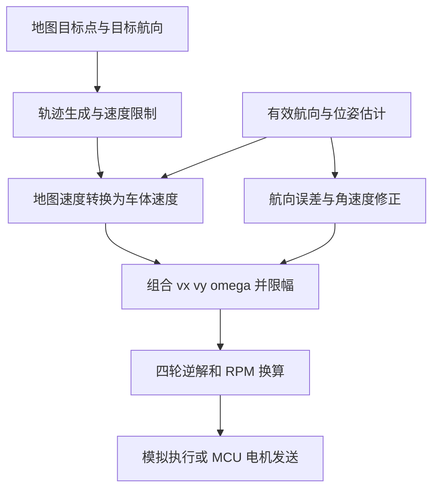

# 底盘参数与二维地图控制设计基线

版本：v0.1；整理日期：2026-09-12。

用途：汇总作者提供的底盘数据、已审阅的开源控制实现及当前固件差距，为后续二维地图模拟和分步修改固件提供统一依据。

状态：本文中的硬件确认情况见第 1 节；二维地图约定、接口字段和修改步骤是后续设计建议，尚未实现。本轮只交付文档，没有修改固件、CubeMX 配置、电机参数或上位机程序。

## 1. 硬件参数：事实与待确认项

### 1.1 作者提供的数据

| 参数 | 本轮记录 | 确认程度与来源 |
|---|---|---|
| 主控 | STM32F407VGT6 | 当前工程基线 |
| 左前至左后轮心距离，即轴距 L | 约 **210 mm** | 作者提供“大致 21 cm”；后续精测 |
| 左后至右后轮心距离，即轮距 W | 约 **240 mm** | 作者提供“大致 24 cm”；后续精测 |
| 麦轮品牌 | 天府之土 | 作者口述，未核对具体 SKU |
| 麦轮直径 D | 暂按 **80 mm** | 作者表述为“应该是 80 mm”，不是最终实测值 |
| 麦轮排列 | **X 型** | 作者确认；正向极性另行实测 |
| 电机 | 42 步进电机，Emm 固件 | 作者确认；42 表示机座规格，具体型号和步距角待核实 |
| 电机到车轮传动比 G | 暂按 **1:1** | 根据对话将第一句理解为直连，尚未取得更明确说明；若有减速机构必须修正 |
| 左前 / 左后 / 右后 / 右前地址 | **1 / 2 / 3 / 4** | 作者确认 |
| HWT101 | 作者已完成模块内部零偏校准 | 用户反馈；不等于本轮重新做过实物验证 |

轴距、轮距均测量轮轴中心之间的距离；轮径测量包含滚子的最外径。受载后的有效滚动直径可在后续直线实测中校正。

**210×240 mm 是轮心矩形，不是整车外廓。** 不能直接拿它当二维地图的碰撞矩形。

### 1.2 驱动器“默认设置”只能作为临时假设

| 项目 | 当前软件的假设 | 后续确认方法 |
|---|---|---|
| 步距角 | 1.8°，每圈 200 整步 | 电机标签/具体型号/驱动配置 |
| 细分 | 16 | 驱动器参数读回或上位机截图 |
| 命令脉冲每圈 | 3200 | 仅在前两项成立时有效 |
| 速度输入缩放 | 1 个命令单位 = 1 RPM | 确认未开启速度缩小 10 倍输入 |
| 控制状态 | 预期闭环模式 | 检查实际驱动配置，不能只凭固件名称判断 |
| 应答方式 | 未确认 | 读回 None/Receive/Reached/Both/Other，决定应答和到位处理 |
| 心跳停车 | 未确认是否启用、时间多少 | 读回配置并做后续实物测试 |
| 四轮前进极性 | 左侧 dir=0，右侧 dir=1 | 当前代码值；架空逐轮确认 |
| HWT101 航向符号 | 当前代码 +1 | 验证车体逆时针转动时模块角度是否增加 |

本地保存的 X42S 手册可用于核查当前 Emm 驱动设计，但作者本轮只确认“42 步进电机”，不能据此重新断言所有参数都属于某一版 X42S。实施前核对电机实际型号、固件版本。

## 2. 与当前源码的差异

主要文件：[chassis_config.h](../../Code/template/App/chassis_config.h)、[mecanum_chassis.c](../../Code/template/App/mecanum_chassis.c)、[motor_id_config.h](../../Code/template/App/motor_id_config.h)。

| 配置 | 当前代码 | 后续拟采用 |
|---|---:|---:|
| `CHASSIS_WHEELBASE_MM` | 150 mm | 210 mm，标记近似测量 |
| `CHASSIS_TRACK_WIDTH_MM` | 250 mm | 240 mm，标记近似测量 |
| `CHASSIS_WHEEL_DIAMETER_MM` | 100 mm | 80 mm，标记待确认 |
| `CHASSIS_MOTOR_TO_WHEEL_RATIO` | 1 | 暂保持 1，核实直连 |
| 旋转力臂 k | 200 mm | 225 mm |
| 电机地址 | 1、2、3、4 | 与作者确认一致 |
| 前进方向 | 0、0、1、1 | 实测前不因编号确认而认定正确 |

以上参数尚未写入固件。旧分析文档里按 100 mm 计算的例子保留为历史状态；今后的模拟应采用本文的 80 mm 暂定基线，并显示参数确认状态。

如果实物确为 80 mm，却仍按 100 mm 发轮速，在其他条件一致时，实际轮缘速度只有目标的约 80%。这类比例误差不应通过 PID 参数补偿。

## 3. 统一坐标、轮号与单位

### 3.1 车体坐标系 B

- 原点：四轮中心围成矩形的中心。
- xB：车头方向为正；yB：车体左侧为正。
- 正角速度：俯视逆时针。
- 内部几何计算采用 mm、s、rad；轮速驱动接口采用 RPM。
- 四轮数组顺序始终为：左前、左后、右后、右前，即地址 1、2、3、4。

俯视且图中车头朝上时：

```text
                   车头 / +xB
                       ↑
       左前 1 ●────────────────● 4 右前
              │                │
        +yB ← │       O        │       L ≈ 210 mm
              │                │
       左后 2 ●────────────────● 3 右后
                    W ≈ 240 mm
```

按 L=210、W=240，轮心在车体系中的坐标如下。表中正负由坐标定义决定，不由屏幕上下左右决定。

| 轮子 | 地址 | xB / mm | yB / mm | 数组下标 |
|---|---:|---:|---:|---:|
| 左前 | 1 | +105 | +120 | 0 |
| 左后 | 2 | -105 | +120 | 1 |
| 右后 | 3 | -105 | -120 | 2 |
| 右前 | 4 | +105 | -120 | 3 |

### 3.2 建议的二维地图坐标系 M

地图建模使用 X 向右、Y 向上，航向 θ 从地图 +X 轴逆时针测量。θ=0 表示车头朝右，θ=π/2 表示车头朝上。地图原点可选择场地基准角，但应在地图配置中明确位置，不能让图像像素坐标隐式决定毫米坐标。

起始位姿 `(X0,Y0,θ0)` 由摆车位置或定位结果确定。HWT101 的上电角度/归零角度不自动等于场地坐标零方向。

若屏幕像素 y 向下，以 `(u0,v0)` 为地图原点在屏幕的位置，比例 s 为 px/mm：

```text
u = u0 + s*X
v = v0 - s*Y
```

车身任一点 pB 先经过第 4 节的车体到地图旋转和平移，再做上述像素转换。若直接用 Canvas 旋转且图形局部车头朝 +x，屏幕旋转角应为 -θ；图标默认朝上时还需处理图标初始朝向偏置。

### 3.3 HWT101 与地图航向

建议建立一次航向锚点：

```text
θ_map = θ0 + yaw_sign * (yaw_unwrapped - yaw0_unwrapped) * π/180
```

`yaw_sign` 经实物验证；跨越 ±180° 时先展开角度。归零、重新校准或模块重启后应重新建立锚点，不继续沿用之前的累计角度。

现有航向 PID 使用 deg 输入、rad/s 输出，可保留其接口，在地图边界显式转换，不必为模拟一次性重写全部 PID。

## 4. 可共用的运动学模型

以下公式是理想无滑移、平面刚体、与当前 X 型麦轮安装匹配的运动学。实物方向仍以逐轮和整车测试确认。

### 4.1 车体速度到四轮速度

记 vx 为车体前向 mm/s，vy 为车体向左 mm/s，ω 为逆时针 rad/s。

```text
k = (L + W)/2 = 225 mm

v1 = vx - vy - k*ω       左前
v2 = vx + vy - k*ω       左后
v3 = vx - vy + k*ω       右后
v4 = vx + vy + k*ω       右前

rpm_i = vi * 60 * G / (π*D)
```

这里 rpm_i 是带方向的逻辑轮速：正数表示该轮向车头方向滚动。驱动层再根据各轮前进极性拆成 `dir` 与非负速度值，模拟模型不要直接拿 Emm 的 CW/CCW 当车体前后。

### 4.2 四轮速度到车体速度

对实测带符号电机 RPM，先计算 `vi = rpm_i * π*D/(60*G)`：

```text
vx = ( v1 + v2 + v3 + v4)/4
vy = (-v1 + v2 - v3 + v4)/4
ω  = (-v1 - v2 + v3 + v4)/(4*k)
```

用目标 RPM 代入得到的是目标速度或模型推算，不是实测速度。反馈的符号和采样时间必须对齐后再用于里程计。

### 4.3 地图与车体转换

地图速度转车体速度：

```text
vx =  cos(θ)*VX + sin(θ)*VY
vy = -sin(θ)*VX + cos(θ)*VY
```

车体速度转地图速度：

```text
VX = cos(θ)*vx - sin(θ)*vy
VY = sin(θ)*vx + cos(θ)*vy
```

轮心和车身顶点的位置转换使用同一旋转矩阵：`pM = [X,Y] + R(θ)*pB`。

在无测量反馈的第一版模拟中，可按小步长用中点航向积分：

```text
θ_mid = θ + ω*dt/2
X_next = X + (cos(θ_mid)*vx - sin(θ_mid)*vy)*dt
Y_next = Y + (sin(θ_mid)*vx + cos(θ_mid)*vy)*dt
θ_next = θ + ω*dt
```

这是数值近似，dt 用秒和真实模拟步长，不假定每次浏览器刷新都准确间隔固定时间。浏览器长时间挂起后应暂停或分小步处理，不能一次积分出巨大跳变。恒定车体速度、ω≠0 的情况可用圆弧解析解核对收敛。

### 4.4 位置命令与参数换算

在 1.8°、16 细分、G=1 假设成立时：

```text
每圈命令脉冲 N = 200*16 = 3200
轮周长 C = π*80 ≈ 251.3274 mm
命令脉冲幅值 = round(abs(轮缘路程)*G*N/C)
```

不得混淆三种量：命令脉冲数、物理编码器分辨率、通信协议位置单位。当前本地 X42S 手册第 72 页规定 Emm `0x36` 回包按每圈 65536 换算；不能把代码中的 16384 编码器宏直接用于该回包。

将车体组合位移线性分解成轮路程，只能在适用的轨迹假设下使用。特别是平移与旋转同时发生时，不能直接把车体系累计位移当成地图位移。第一版地图执行优先输出随时间变化的车体速度。

### 4.5 数字检查样例

以下均基于 D=80、L=210、W=240、G=1；RPM 列是打包前的理想值，不是现场测试结果。

| 输入/动作 | 四轮结果或位姿预期 |
|---|---|
| vx=100，vy=0，ω=0 | 四轮 +100 mm/s，各 +23.8732 RPM |
| vx=0，vy=100，ω=0 | 轮速 [-100,+100,-100,+100] mm/s |
| vx=0，vy=0，ω=0.1 | 轮速 [-22.5,-22.5,+22.5,+22.5] mm/s，约 ±5.3715 RPM |
| θ=90°，车体 vx=100，vy=0 | 地图 VX=0、VY=100 mm/s |
| θ=90°，地图 VX=100、VY=0 | 车体 vx=0、vy=-100 mm/s |
| 纯前进 100 mm | 各轮约 1273 命令脉冲，取整前 1273.2395 |
| 理想纯逆时针旋转 90° | 左轮负、右轮正；各轮路程幅值约 353.429 mm；各 4500 命令脉冲 |

新的 80 mm 轮径下，1 RPM 对应 4.18879 mm/s，整数 RPM 的低速量化仍不可忽略：

| 请求轮缘速度 | 理想 RPM | 当前整数命令 | 对应理论速度 |
|---|---:|---:|---:|
| 8 mm/s | 1.9099 | 2 | 8.3776 mm/s |
| 15 mm/s | 3.5810 | 4 | 16.7552 mm/s |
| 100 mm/s | 23.8732 | 24 | 100.5310 mm/s |

## 5. 开源控制实现：借鉴什么

详细源码证据见 [步进底盘底层对照记录](../开发记录/2026-09-12步进底盘底层与开源实现对照.md)；下表保留可执行的设计结论。

| 项目 | 查阅的控制部分 | 借鉴点 | 不能直接套用的内容 |
|---|---|---|---|
| [GongXun2025](https://github.com/zpclyn/GongXun2025) | `Chassis.c → StepMotor.c`，目标缓存、轮询发送、同步触发、航向 PID | 分离计算与发送；地图/车体坐标变换；平滑加减速 | 中断里的阻塞等待、未固定四轮同帧快照；旁边的 M3508 `Mecanum.c` 不属于同一驱动链 |
| [gc-stm32F4-](https://github.com/Wuyanzu-wuhu/gc-stm32F4-/blob/a3476a5a309e8676bf9935f51710491cf8c8b057/Hardware/MC.c) | `Chassis_Core`、四轮 `snF=1` 后广播同步 | 最接近本车 UART 步进结构；加速/匀速/减速/转向分阶段 | 原车 PID 参数、轮号、速度比例、固定延时；需按本车单位核对 |
| [enginer-train](https://github.com/Ycn115/enginer-train/blob/8f2f08e42ac95fafdfdb0e51af525893c98ff47b/Drivers/Hardware/move.c) | 同步速度控制、四轮位置读取、剩余距离调速 | 用反馈描述进度与到位，替代只靠时间 | 长 while、逐轮阻塞读取；其中更新 Angle_Pid 却使用 Blance_Pid.Out 的路径不能照抄 |
| [gcs-gold-medal](https://github.com/yuanxiexie531-glitch/gcs-gold-medal/blob/cb1b0299a3083d59ebb767831a2778fe35a53ef7/yyb_stm32/can_ZDT/yyb_move.c) 与 [gongchuangsai_MBH](https://github.com/cheese-shredded-ice/gongchuangsai_MBH/tree/debe55def09374ad147e131f2ee0095412dfcdcd) | CAN 步进控制、位置同步及流程分段 | 对照速度与位置模式的组织 | CAN 发送封装、原车参数；同源项目不算独立实物验证 |
| [2025GongChuang_AGV](https://github.com/Thirtynine3939/2025GongChuang_AGV/blob/f1fbab3605f4941fdc14a13d9380aa48700a4b87/程序/下位机/Chassis_v2.0.zip) | `car.c`、`motor.c`、任务调度 | 航向与动作任务分开；起止时间和目标管理 | 电机由定时器脉冲驱动，不能复制其 ARR/CCR 代码替代 UART5；轮子布局与系数需重新核对 |

参考工程证明的是“代码中写了什么”，不证明本车使用后会达到相同精度。借鉴结构和计算方法，按本车接口重新实现；直接复制源文件之前还应核对其许可证。

## 6. 当前固件能力与二维地图的关系

| 当前能力/限制 | 后续地图必须如何表达 |
|---|---|
| `Mecanum_Wheel_Speed_Calc` 已有物理单位逆解 | 与模拟使用相同轮序、符号、几何参数 |
| 普通速度控制四轮立即执行，逐轮延时 10 ms | 理想模拟可先同时更新，但应标为理想模型；硬件响应不能冒充同步执行 |
| `HAL_OK` 只表示 DMA 启动成功 | 区分请求、发送、接受、执行、到位；网页按钮成功不等于车已到位 |
| 底盘缺少独立四轮反馈与里程计 | 现阶段地图轨迹只能是指令推算，不能标“实测位置” |
| 独立航向测试已使用 HWT101 模块角度 | 可以用来逐步验证地图航向正负；模块校准与本次启动的静止验证是不同步骤 |
| 视觉搬运仍传入 ω=0 | HWT101 校准完成不代表视觉搬运已锁航向 |
| 位置模式四轮同速但路程可不同 | 同步开始不保证同时结束，不能承诺任意组合位移的直线路径 |
| UART5 同时服务底盘 1–4 和机械臂 5–7 | 四轮下发与反馈应协调总线所有权，不能由地图端直接绕过 MCU 管理 |

现有地图相关通信入口也要区分：本车 USART1 是文本控制台，原生 USB CDC 与香橙派使用 Camera/B2 视觉协议。新地图数据不应不加区分地混入 B2，也不能套用早期 `sys.ping#` 网页协议。

## 7. 二维模拟地图第一版建议

### 7.1 先做纯模拟，再接实物反馈

建议第一版只实现以下范围：绘制车辆与轮心、设置起始位姿、输入车体速度、显示四轮 RPM、积分显示轨迹、暂停/复位、毫米与像素比例。暂不引入完整导航算法和复杂动力学。

可以比较两种模式：

- **理想运动学**：不量化 RPM、不模拟串口延迟，用于验证公式和坐标。
- **命令近似模型**：先按驱动配置量化 RPM，再正解、积分；后续逐步加入发送周期和经过验证的加速模型，用于观察软件约束。

二者都不是实物定位。启用反馈后再增加实测轮速/位置和 HWT101 航向。不要用模拟位姿替代实车安全决策。

### 7.2 目标、估计与测量必须分开

建议地图至少区分：目标轨迹、指令推算轨迹、反馈估计轨迹。没有某类数据时隐藏或标记不可用，不把旧值继续显示为实时测量。

轮速反馈可用正运动学得到车体平移速度，HWT101 提供航向变化；两者仍不能消除麦轮滑移导致的 XY 漂移，后续才考虑已有视觉、定位轮或其他外部观测。

整车外廓需另填：底盘最大长宽、轮子突出尺寸、机械臂收拢/伸出轮廓，以及是否载物。尚无数据时可以画轮心和示意车身，但应禁用“碰撞已验证”的结论。

### 7.3 建议共享的数据字段

这是未来内存/日志数据模型，不是已经实现的串口帧或命令：

| 数据 | 建议字段 | 单位/说明 |
|---|---|---|
| 几何配置 | wheelbase_mm、track_mm、wheel_diameter_mm、gear_ratio | 同时保留 measured/estimated/assumed 等确认状态 |
| 轮号配置 | wheel_ids、forward_dir | 固定顺序 [左前,左后,右后,右前] |
| 车体目标速度 | vx_mm_s、vy_mm_s、omega_rad_s | 先转换成车体系，再进入底盘逆解 |
| 目标轮速 | wheel_rpm_target[4] | 带逻辑方向；可另显示量化后的指令轮速 |
| 轮速反馈 | wheel_rpm_measured[4]、有效性、采样时间 | 不能把目标值复制到此字段 |
| 地图位姿 | x_mm、y_mm、yaw_rad、source、valid | source 区分 simulated/command_estimate/feedback_estimate |
| 动作状态 | idle/running/done/error、原因、动作标识 | done 的判据必须写明是模拟结束、超时结束还是反馈到位 |
| 时间信息 | MCU 采样时间、接收时间、启动会话标识 | MCU 重启后重新建立时间关系，不用串口助手显示时间代替采样时间 |

不要在第一版就修改现有所有串口命令。先让模拟和固件对同一组输入得到一致轮速，再设计实际需要的最小遥测输出。

### 7.4 地图路径如何进入底盘



在“跟随目标航向”和“直接给角速度”之间明确模式，不能让地图端和 MCU 同时各算一遍相同航向修正。对于未来实物执行，建议航向闭环保留在 STM32，地图发送目标及限制；第一版纯模拟可使用同一控制规律验证。

地图上点击目标点不是当前固件已有的自主导航能力。实物执行还需要可用位姿、轨迹/到位判据和通信中断处理，不能直接把目标坐标作为 Emm 脉冲数发送。

## 8. 分步修改固件的路线

各阶段分别审查、实施、编译和验证；此表没有授权自动执行这些修改。

| 阶段 | 主要文件/范围 | 最小改动 | 验收 |
|---|---|---|---|
| A 几何基线 | `chassis_config.h`、说明注释 | 按确认程度更新 210/240/80，核实减速比，移除过时参数注释 | 编译；纯计算结果符合第 4.5 节；记录实物方向 |
| B 单轮反馈 | `Emm_V5`、UART5 接收与地址分发 | 先接一轮状态/位置查询，再扩展四轮缓存；不一次完成全车里程计 | 一圈命令、实际圈数和反馈单位一致；错误/无回复可识别 |
| C 四轮发送 | `mecanum_chassis.c`、共享 UART5 发送管理 | 同一目标快照、snF=1、同步触发、发送完成和合理帧间隔；避免阻塞整圈 | 四轮指令完整、失败不误报成功、机械臂共享总线不混淆 |
| D 低速分辨率 | 驱动参数确认、RPM 打包 | 决定是否启用 0.1 RPM，并匹配四台电机与程序；不自动修改设备 | 8/15/100 mm/s 命令与读回速度相符，比例无十倍误差 |
| E 航向控制 | 独立测试、后续 `MaterialVision.c` | 先低速验证方向与限幅，再用于视觉短动作 | 偏左/偏右时修正方向正确，角度失效停车，动作起点明确 |
| F 地图反馈 | 遥测接口与上位机适配 | 输出实际可用状态、时间和来源；逐步加入轮速里程计 | 地图坐标/航向与实物方向一致；重启不拼接旧轨迹 |

其他已查明的约束：

- 当前软件速度上限 5000 RPM 与本地 X42S 手册 Emm 的 3000 RPM 不一致，应先核对实物型号后统一。协议上限不能作为小车推荐运行速度。
- `acc=20` 是驱动加速度档位，不是 20 mm/s²；MCU 再叠加轨迹加速时要考虑双重平滑引起的滞后。
- 超出某轮速度上限时应考虑整组同比例缩放，避免各轮独立截断改变运动方向。
- 不依靠 `距离/目标速度` 当作真实到位证据；模拟结束、定时结束、轮子到位与车体到位分别定义。
- 位置模式 raF=0 相对上一目标，raF=2 相对当前实时位置，中途停止后尤其不能混用。
- 同步广播会触发总线上已经缓存的同步命令，失败后的残留缓存必须明确处理；不能假定所有停止命令都会清除缓存。

## 9. 模拟与实物的验证清单

| 检查 | 预期结果 |
|---|---|
| 零速度 | 四轮为零；理想位姿不变化 |
| 前进/左移/逆时针 | 轮速符号符合第 4.5 节；屏幕方向符合坐标约定 |
| 正解与逆解互验 | 未限幅、未量化时恢复输入 vx/vy/ω，允许浮点误差 |
| 航向 90° 与 -90° | 前进方向随车头旋转，不出现地图与车体混用 |
| 跨 ±180° | 显示可归一化，累计轨迹不发生一整圈跳变 |
| 恒速一步与多步积分 | ω=0 时一致；ω≠0 时随步长缩小收敛至解析圆弧 |
| 量化模式 | 第 4.5 节整数 RPM 例子可复现；与理想模式明确区分 |
| 轮径或轴距更新 | 地图与固件使用同一版本参数，不沿用历史 100 mm 示例 |
| 重启/断流 | 测量有效性失效；不将旧反馈继续算作新数据 |
| 实物单轮一圈 | 方向、3200 脉冲假设、反馈每圈单位分别验证 |
| 实物低速直行和横移 | 分别记录位移、偏航和实际时间，用于有效轮径/滑移评估 |
| 车身碰撞显示 | 只有确认外廓和地图比例后才有意义，机械臂姿态需纳入 |

## 10. 后续还需补充的数据

可先开展理想模拟，不必等待所有数据齐全；接实物和碰撞验证之前补齐：

1. 电机具体型号、步距角、细分、速度缩放、应答和心跳配置；四轮实测前进极性。
2. 80 mm 轮径与直连确认，轴距/轮距精测。
3. 整车外廓及机械臂不同姿态的投影范围。
4. 所选二维地图平台、场地尺寸、坐标原点、比例及初始位姿；使用赛事场地时以本项目正式赛题资料为准，不另猜尺寸。
5. 进入动力学/高速调参阶段再补整车质量、负载、供电电压、实际速度和制动能力。

## 11. 依据与维护约定

- 作者在本轮前提供的尺寸、排列、地址和 Emm 固件信息。
- [步进底盘底层与开源实现对照](../开发记录/2026-09-12步进底盘底层与开源实现对照.md)：保留旧参数下的审阅结果。
- [HWT101 开源校准核查](../开发记录/2026-09-12工创开源HWT101零偏校准核查.md)：模块校准与外部补偿的区别。
- [X42S 用户手册 V1.0.5](../硬件资料/执行机构/闭环步进电机/ZDT_X42S第二代闭环步进电机用户手册V1.0.5_260527.pdf)：第 37/60 页同步，第 53/57 页 Emm 命令，第 72 页反馈单位，第 81 页速度缩放；适用性需与实物型号核对。
- [新 PCB 与 USB 迁移记录](../开发记录/2026-09-11新PCB与USB通信迁移.md)：当前总线和视觉协议基线。

以后修改本文时记录参数来源和验证日期，把“待确认”改为“实测”需有实际结果。实现某阶段后补充代码位置、编译日志和实物结果，不能仅因文档里已有设计就标记功能完成。
