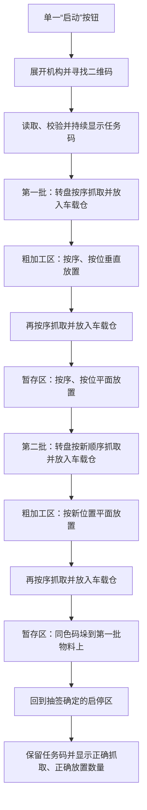

# 智能搬运赛题设计与开发指导

> 文档定位：把赛题文件转化为机械结构、电控、视觉、软件和测试的设计输入。本文不是新的竞赛规则；报名通知、赛前补充文件、领队会说明和现场裁判指令始终优先。
>
> 适用范围：第九届湖南省大学生工程实践与创新能力大赛“智能+工程创新赛道”中的智能搬运赛项，并参考 2027 年赛道命题解析材料。
>
> 最后核对日期：2026-08-21。

## 1. 原始资料、证据等级与使用方法

| 代号 | 原始资料 | 本文如何使用 | SHA-256 |
| --- | --- | --- | --- |
| R1 | [附件2-1：竞赛命题与运行](<./原始资料/附件2-1-第九届中国大学生工创大赛智能+工程创新赛道命题与运行.pdf>) | 任务、场地、作品约束和竞赛流程的主要依据 | `CFB9A1172DA51D40EA9E10859F9004863D52E77CBC1EF6E572AC761D9B26811A` |
| R2 | [附件2-2：评分与规则](<./原始资料/附件2-2-第九届中国大学生工创大赛智能+工程创新赛道评分与规则.pdf>) | 得分、终止比赛、成绩计算的主要依据 | `9DFFDC6902F4BB5696065D50CE768C42621D3332B626DD453C2FEA4FBD1E48C3` |
| R3 | [2027 年赛道竞赛命题解析（宣讲材料）](<./原始资料/2027年智能+工程创新赛道竞赛命题解析（宣讲材料）.pdf>) | 用实物照片、赛场图和流程图辅助理解，不覆盖 R1、R2 | `8037EFB99DBA5185F11B9B0CBA30F71025B77FBA2D3A7F875D6E0FA9AECCD498` |

使用资料时按以下顺序判断：

1. 现场最新发布的规则、补充说明和裁判指令；
2. R2 中的评分及终止规则；
3. R1 中的命题、尺寸、环境和运行流程；
4. R3 中的解释、照片和示例。

三份资料有几处表述范围不同，设计时应采用更严格、风险更低的解释：

- R3 说任务码应“静态、始终显示”，R1 还要求显示任务码和完成情况。建议屏幕固定保留完整任务码，另设抓取、放置统计区域，不用统计信息覆盖任务码。
- R3 将“15 秒没有移动”概括为终止条件；R2 的原文是机器人停止运行 15 秒，等待转盘转动时增加 8 秒。程序应以 R2 为准，并把具体判定口径列入领队会确认项。
- R3 说决赛场景会有“小改变”；R1 明确决赛的区域、位置、形式、尺寸、参数、物料形状、颜色以及编码获取方式均可能现场公布。因此机械和软件不能只适配初赛锥台物料与固定坐标。

## 2. 赛题的本质

这不是单纯的循迹小车题，而是一条受严格时序约束的微型柔性制造物流链：机器人需要先读取任务，再从动态转盘按颜色顺序取料，完成两次“原料区 → 粗加工区 → 暂存区”的搬运，其中第二批还要在第一批上同色码垛，最后回到指定启停区并显示统计结果。全过程完全自主，不允许遥控或赛中人工干预。（R1，第 1、7-8 页；R3，第 9、18-24 页）

真正决定成绩的能力有四层：

1. **合规生存**：尺寸、供电、启动、显示和行车投影全部合规，否则不能参赛或本轮提前结束。
2. **任务理解**：可靠找到二维码、解析四组三位数，并让全车都使用同一份任务数据。
3. **物料闭环**：识别、抓取、车载存放、再次抓取、精准放置和码垛都要有结果确认。
4. **工程鲁棒性**：适应场地偏差、随机障碍、转盘方向和停位误差、颜色色差、两轮不同任务以及决赛变更。

## 3. 一轮初赛的完整任务链

任务码格式为 `AAA+BBB+CCC+DDD`：

- `AAA`：第一批三个物料的颜色和搬运顺序；
- `BBB`：第一批物料在粗加工区和暂存区的位置编号；
- `CCC`：第二批三个物料的颜色和搬运顺序；
- `DDD`：第二批物料在粗加工区的位置编号；
- 颜色编号：红 1、黄 2、蓝 3、绿 4、黑 5、浅蓝 6。（R1，第 6 页）

例如 `156+123+516+231` 表示：第一批按红、黑、浅蓝抓取，并依次放到 1、2、3 号位；第二批按黑、红、浅蓝抓取，并依次放到粗加工区 2、3、1 号位。第二批在暂存区不再由第四组单独指定位置，而是码垛到相同颜色的第一批物料上。



最容易被忽略的机械规则是：**跨区域行驶时不允许用手爪夹持物料，物料必须先放到机器人本体上；同一区域内的移动不受此限制。** 因此末端执行器不能兼任全程载具，机器人必须有可靠的车载仓位。每次从原料区或粗加工区离开前，都需要确认物料已经被释放到车载仓内。（R1，第 8 页）

## 4. 硬约束清单

### 4.1 作品与机械

| 约束 | 规则事实 | 设计含义 |
| --- | --- | --- |
| 自主制造 | 除标准件外，非标零件应自主设计制造，不能用成品套件拼装 | 保存 CAD、工程图、加工记录和版本记录；采购件与自制件边界要清楚 |
| 初始外形 | 铅垂投影不大于 `300 mm × 300 mm`，高度不超过 `400 mm`，软质线路也计入 | 检录按最外侧线缆、拖链、屏幕和机械臂计算；建议留尺寸余量，不按 300 mm 极限设计 |
| 展开 | 机械臂允许折叠，但只能在出发后自行展开；展开后不受初始尺寸限制 | 展开动作必须由一键启动后的程序完成，不能靠队员辅助 |
| 行走方式与机械臂 | 形式不限；比赛和调试中不能更换零部件 | 初赛一轮内不能靠换手爪解决不同工步；接口需一次装好并兼容全部初赛动作 |
| 行车投影 | 离开启停区后，机器人铅垂投影越出灰色车道即结束本轮，机械臂除外 | 底盘、车载仓、屏幕和非机械臂结构都应保持在车道内；伸入工位的部分应明确属于机械臂 |

依据：R1 第 1-3 页；R2 第 3-4 页。

### 4.2 电控、供电、显示与启动

- 传感器和电机种类、数量不限；机器人只使用电驱动。（R1，第 2 页；R3，第 3 页）
- 只能使用一个安装在机器人内部的电源，不得使用液体或腐蚀、污染环境的电源；比赛期间含调试不能更换。（R1，第 2 页）
- 可与笔记本电脑通信，但运行中不能触碰电脑，也不能以任何方式遥控机器人。核心任务不应依赖队员操作电脑。（R1，第 2 页）
- 任务码显示装置必须位于机器人上部醒目位置，亮光显示、无遮挡，字体实际高度不小于 `12 mm`，并显示任务码与完成情况。（R1，第 2 页）
- 只能有一个明确标识、无遮挡的“启动”按钮；裁判发令后只有一次启动机会。（R1，第 7 页；R3，第 25 页）
- 不允许遮挡场地，只允许垂直向下补光。侧向补光、罩住二维码或用大面积遮光罩改变环境都存在违规风险。（R1，第 2 页）

显示界面建议固定成三块：

```text
TASK 156+123+516+231    // 全程保留，字符实测高度 >= 12 mm
PICK  12                // 经传感器确认的正确抓取数量
PLACE 12                // 经规则口径确认的正确放置数量
```

`128×64` 小 OLED 更适合调试，不宜未经实测就当作正式任务显示器。正式屏幕要从裁判观察方向验证字符高度、亮度、视角和遮挡。

## 5. 场地、工位与物料模型

### 5.1 场地

- 场地为 `2400 mm × 2400 mm` 正方形平面。
- 灰色为可行车区域，中间十字车道宽 `400 mm`；四个淡黄色区域均为 `450 mm × 450 mm`。
- 黑色模拟障碍物尺寸为 `φ50 mm × 100 mm`，数量和位置随机抽签。
- 有两个蓝色启停区，每个 `300 mm × 300 mm`；抽签确定本轮使用的启停区。
- 原料区和二维码板在规定范围内随机摆放，各区域及装置实际位置允许有偏差。
- 初赛主要使用原料区、粗加工区和暂存区；精加工区、成品区及更多变化可能在决赛出现。（R1，第 3-4 页，图 1、表 2）

若车体非机械臂部分的实际横向投影宽度为 `W`，在 400 mm 车道中心行驶时，几何上单侧最大中心偏差只有：

```text
e_max = (400 - W) / 2
```

这是纯几何上限，不包含场地铺设误差、轮胎侧滑、控制超调和裁判观察误差。例如 `W=280 mm` 时理论上只有 `60 mm`，控制目标还必须再留安全余量。这个关系说明底盘外形越接近 300 mm，导航容错越小。

### 5.2 原料区转盘

- 顶面直径 `300 mm`，总高度 `80-100 mm`。
- 每批均匀放置 3 个物料，物料中线相隔 `120°`；图示物料中心分布圆直径为 `200 mm`。
- 转盘匀速 `6-10 s/圈`，方向随机；每圈停留次数、停留时间和最终停位以现场为准，停位存在误差。（R1，第 4 页，图 2）

设计不能只记忆一个固定抓取坐标。至少需要“检测转盘相位或物料位置 → 预测/等待抓取窗口 → 低速接近 → 抓取确认”的闭环。等待转盘时还要满足停机判定规则。

### 5.3 粗加工区与暂存区

- 两个区域均为 `580 mm × 150 mm`。
- 三个目标圆环的最外侧中心间距为 `300 mm`，即相邻中心名义间距 `150 mm`。
- 圆环线宽 `1.5 mm`，中心标有 1、2、3。（R1，第 4-5 页，图 3、图 4）

圆环直径和位置分数为递推关系：

| 环号 | 外径 | 对圆形底面中心误差的近似径向余量 | 单次分数 |
| --- | --- | ---: | ---: |
| 1 环 | `φ + 3` | `1.5 mm` | 15 |
| 2 环 | `φ + 8` | `4.0 mm` | 10 |
| 3 环 | `φ + 15` | `7.5 mm` | 7 |
| 4 环 | `φ + 25` | `12.5 mm` | 5 |
| 5 环 | `φ + 35` | `17.5 mm` | 3 |
| 6 环 | `φ + 45` | `22.5 mm` | 1 |
| 6 环外或倾倒 | - | - | 0 |

表中“径向余量”是依据同心圆与圆形底面作出的几何推算，不是规则原文。它揭示了一个关键事实：要稳定拿到 1 环 15 分，末端在最终释放时需要接近毫米级的综合定位能力。底盘里程计只能负责到达工位附近，最后几十毫米应使用工位局部视觉或机械基准完成精定位。（R1，第 5 页，表 3；R2，第 2-3 页，图 1、表 3）

物料底面一旦与地面接触就视为放置完成，成绩按该位置确定；再次在场地上推移物料会直接结束本轮。因此 XY 校正必须在物料悬空时完成，最后只做受控的竖直下降、释放和竖直撤离。（R2，第 3 页）

### 5.4 初赛物料与决赛变化

- 初赛物料为 3D 打印 ABS 或 PLA，最大尺寸不超过 `80 mm`，质量不超过 `100 g`。
- 颜色为红、黄、蓝、绿、黑、浅蓝，每种颜色两个；现场可能存在色差。
- 初赛三种颜色使用同一锥台形回转体。图 5 名义尺寸为：总高 `60 mm`、顶部直径 `φ30 mm`、底部直径 `φ50 mm`，顶部和底部圆柱段高度各 `8 mm`。（R1，第 5-6 页，图 5）
- 决赛可能出现圆柱、方形体、三角形、球体、锥体和组合体等，具体尺寸、颜色、任务编码及获取方式现场公布。（R1，第 6 页）

因此初赛手爪可针对锥台优化，但机械臂负载、开口、行程和软件接口应覆盖 `80 mm / 100 g` 上限，并为决赛现场更换或制作适配件预留明确的机械、电气和参数接口。

## 6. 计分结构与设计优先级

### 6.1 总成绩

初赛：

```text
P = A × 20% + B × 10% + C × 70%
```

- `A`：任务命题文档，内容质量 75 分、排版 25 分，再按参赛队最高分归一化。
- `B`：作品创意设计，创新性 40、美观性 30、合理性 30，再按参赛队最高分归一化。
- `C`：两轮现场初赛取最好一轮的原始得分，再按现场最高原始得分归一化。（R2，第 1-4 页）

文档中出现地名、单位名、姓名、电话号码或无关特殊符号，修改模板既有标题，或文档雷同，A 均可能为 0；同校作品外形雷同，B 为 0。用于比赛提交的任务命题文档必须与本项目内部指导文档分开管理，提交前做匿名化专项检查。

决赛中创新实践 `D` 占 30%，现场决赛 `E` 占 70%。创新实践完成情况还形成 `A > B > C` 的等级门槛；未按要求使用现场设备、材料或软件完成现场任务会进入 C 等级并取消后续决赛资格。初赛成绩不带入决赛。（R1，第 8-9 页；R2，第 4 页）

### 6.2 现场原始得分

| 得分事件 | 分值 | 设计含义 |
| --- | ---: | --- |
| 正确读取二维码并在屏幕显示任务码 | 1 | 分值小，但它是后续所有顺序和位置得分的前提 |
| 每次按任务顺序正确抓取并放到车载仓 | 2 | 必须有抓取成功与入仓确认，不能只按动作次数累加 |
| 平面放置 | 每件 15/10/7/5/3/1/0 | 一轮共有 9 次平面放置：两批粗加工区 6 次、第一批暂存区 3 次 |
| 第二批码垛 | 每件得分同对应第一批物料 | 下层位置正确、颜色一致且上层不掉落才得分；下层精度同时影响上下两件 |
| 完成全部流程并返回指定启停区 | 2 | 只有完成全部流程后返回才满足该项表述 |
| 正确显示抓取数、放置数 | 各 2 | 应显示经过状态确认的“正确数量”，不是命令发送数量 |

依据：R2 第 2-3 页。

按完整任务流程的字面理解，6 个物料都会经历“原料区入仓”和“粗加工区再次入仓”，共 12 次抓取入仓，理论抓取分 24；9 次平面放置加 3 次码垛若全为 1 环，理论放置分 180；再加二维码 1、回区 2、统计 4，原始分理论上为 211。**但 R2 没有明确列出原始总分上限，也没有逐项说明粗加工区的再次抓取是否全部计入 2 分抓取项，这一点必须在领队会确认。** 即使只按 6 次原料区抓取计分，放置仍约占原始分的九成，所以总体设计结论不会改变：精准放置和码垛是最高优先级。

其中第一批暂存区的三个下层物料尤其重要。每个物料在 1 环内可得 15 分，同时又使对应上层码垛有机会再得 15 分，相当于一个下层位置控制着最多 30 分。优先把“暂存区第一批高精度平放”做稳定，再追求全程速度。

## 7. 机械系统设计输入

### 7.1 底盘

当前工程已有四轮麦克纳姆底盘运动学、闭环步进电机同步控制和 JY61P 航向保持基础。麦轮横移适合在工位前做侧向微调，但它也容易受轮径误差、地面摩擦差异和侧滑影响。设计时应把任务分成两段：

1. **全局移动**：编码器/电机反馈加 IMU 航向保持，把车送到工位附近，并始终守住车道边界。
2. **局部对位**：利用工位圆环、边缘、数字标记或附加允许识别的自然特征，估计机器人相对工位的横向、纵向和偏航误差，再低速收敛。

机械上需要同时满足：

- 实测最外包络而不是只看轮心距，特别检查轮毂、电机、屏幕、接插件、拖链和松弛线缆；
- 重心低且展开机械臂时不倾覆，最不利姿态按 `100 g` 物料和最大伸展估算；
- 轮胎不在原地高速打滑，低速对位阶段限制加速度和横摆角速度；
- 保留可测量的车体基准面，便于赛前用直角尺、300 mm 检录框和场地基准校准。

### 7.2 机械臂与末端执行器

末端执行器至少要覆盖四种动作：

1. 从高度 `80-100 mm` 的旋转平台抓取高 `60 mm` 的初赛物料；
2. 把物料放入车载仓并完全释放；
3. 从车载仓取出物料，在圆环中心竖直放置；
4. 把第二批物料竖直、同心、低冲击地码放在第一批同色物料上。

推荐把指标写成接口，而不是过早锁死某种机械结构：

- 抓取开口覆盖 `φ30-φ50 mm` 初赛关键表面，并为 80 mm 决赛上限留扩展能力；
- 夹持后能检测“有料”，释放后能检测“已离爪”；
- Z 轴具有可控的低速末端段，释放时不带水平速度；
- 结构顺应量可吸收少量姿态误差，但不能用大柔性换取晃动；
- 手爪、腕部、线缆和相机在初始状态全部收进 300 mm 投影与 400 mm 高度；
- 决赛适配件采用明确的快拆机械基准和防反插电气接口，但初赛比赛及调试过程中不得临时换件。

夹爪、真空吸取和包络式抓取各有取舍。锥台初赛物料适合从圆柱段或锥面自定心夹持；真空对 3D 打印表面和决赛异形件的适应性需要实测；包络式手爪对形状宽容，但容易遮挡局部视觉和增加初始包络。选型必须通过旋转转盘、码垛和掉电保持三个试验决定。

### 7.3 车载仓

规则允许一次携带 1-3 个物料，但跨区域时不能夹在手爪上。若希望减少往返并在 3 分钟内完成全流程，车载仓应至少有 3 个独立、可定位的槽位：

- 槽位与任务序号建立映射，避免第二次取出时顺序混乱；
- 能确认每个槽位的占用状态；
- 行驶、横移和制动时物料不会滚出、倾倒或相互碰撞；
- 物料可被手爪再次稳定抓取，不需要在仓内搜索；
- 仓体属于机器人非机械臂部分，任何展开都不能使其越出车道投影。

先用 1 个物料完成“抓 → 入仓 → 取出 → 放置”的最小闭环，再扩展到 3 槽并行装载。这样可以分别验证末端执行器和仓位索引，避免一次引入过多故障源。

### 7.4 电源与电气

一个电池要同时承担底盘、机械臂、视觉计算、显示和传感器负载，而且比赛中不能更换。电源设计至少包括：

- 电机母线与逻辑电源分级稳压，视觉和 MCU 不因机械臂堵转或底盘加速复位；
- 主回路保险、反接保护、欠压监测和可观察的剩余电量；
- 按两轮 `3 min 调试 + 3 min 运行`、等待时间和安全余量做完整赛程放电试验；
- 在最低允许电压下重复二维码识别、三物料搬运和最远伸臂动作；
- 唯一的“启动”按钮与总电源、安全断电的定义分开，并在检录前确认额外安全开关是否符合现场口径。

## 8. 感知与定位方案应回答的问题

| 感知任务 | 输入变化 | 最小输出 | 失败时的安全行为 |
| --- | --- | --- | --- |
| 二维码寻找与读取 | A4 横板位置随机，二维码 `80×80 mm`，环境光变化 | 原始字符串、四组字段、置信度、时间戳 | 不生成任务就不开始抓取；限次换角度重读 |
| 颜色与物料位置 | 六种颜色有色差，转盘方向和相位随机 | 颜色编号、物料中心、抓取时机 | 低置信度时继续观察，不猜颜色 |
| 车道与障碍 | 灰色车道、随机 `φ50×100 mm` 障碍 | 横向偏差、航向误差、障碍距离 | 减速或停在 15 秒规则允许的恢复窗口内 |
| 工位局部对位 | 工位位置和铺设有偏差，目标精度达毫米级 | 圆环中心/板边坐标及相对位姿 | 不在低置信度时下放物料 |
| 抓取与入仓确认 | 物料可能滑脱、夹偏或槽位已有物料 | 手爪占用、槽位占用、动作结果 | 不跨区域，不错误增加计数 |
| 放置与码垛确认 | 接触后不能再推移，下层可能倾斜 | 已释放、是否倾倒/掉落、位置质量 | 竖直撤离；不进行地面横向修正 |

颜色识别不要只写死一组 RGB 阈值。建议在实际 ABS/PLA、不同批次、场馆灯光和垂直补光条件下采样，使用带亮度归一化的 HSV、Lab 或分类模型，并保存每次识别的置信度。二维码板是竖直的，而规则只允许垂直向下补光，因此二维码算法本身必须能适应环境光，不能依赖正面补光灯。

## 9. 软件架构与任务状态机

### 9.1 建议的数据边界

```c
/* 伪代码：只表达数据边界，不是可直接加入工程的最终接口。 */
typedef struct {
    uint8_t color_order[3];
    uint8_t rough_position[3];
} BatchTask;

typedef struct {
    char raw_code[16];          /* 12 位数字、3 个加号、结尾 \0 */
    BatchTask batch[2];
    bool valid;
} CompetitionTask;

typedef struct {
    uint8_t confirmed_pick_count;
    uint8_t confirmed_place_count;
    uint8_t current_batch;
    uint8_t current_item;
} MissionProgress;
```

任务解析、视觉测量、运动控制和显示模块都读取同一个只读 `CompetitionTask`。二维码未通过格式、范围和排列检查时，不把任务标为有效。至少检查：四段、每段三位、颜色位为 1-6、位置位为 1-3，并根据现场规则决定是否要求每段无重复。

### 9.2 状态机原则

初期不需要 RTOS。固定周期主循环加显式状态机就足够教学和调试，但比赛运行路径中应避免长时间 `HAL_Delay()`。每个状态只做一件事，并具备：进入动作、持续条件、成功条件、超时条件和失败出口。

建议模块按现有工程风格逐步增加，而不是一次性全部实现：

| 模块 | 责任 |
| --- | --- |
| `competition_task` | 二维码字符串校验、任务解析、颜色/位置查询 |
| `mission_fsm` | 只管理赛题步骤和状态转换，不直接操作寄存器 |
| `competition_display` | 持续显示任务码、抓取数、放置数和故障码 |
| `object_handling` | 抓取、入仓、出仓、放置、码垛的动作序列与传感确认 |
| `localization` | 车道导航、里程计、IMU融合和工位局部对位 |
| `run_guard` | 180 秒总计时、状态超时、边界风险、低电压和安全停止 |

关键状态转换条件：

- `READ_TASK → FETCH`：二维码格式有效，屏幕已经成功显示完整任务码；
- `PICK → LEAVE_ZONE`：手爪检测到物料后，车载槽位又确认入仓；
- `ALIGN → PLACE`：目标位置、末端 XY 和偏航误差都进入阈值；
- `PLACE → RETRACT`：完成竖直下降与释放后，只允许竖直撤离，不在地面推物料；
- `BATCH_2_STACK → RETURN`：三个上层物料分别与下层颜色匹配且未掉落；
- 统计数只由经过确认的状态转换递增，不由电机命令发送成功递增。

程序还要有两个不同的时间概念：全局 180 秒比赛计时，以及每个动作的局部超时。若某个动作失败，优先保住已经得到的分数，避免越界、推料或高速打滑这些会直接结束本轮的行为。

### 9.3 决赛适应性

不要把 `go_to_fixed_point(3)` 和“锥台颜色识别”直接写进总任务流程。更稳妥的数据流是：

```text
现场任务输入 -> CompetitionTask / SceneConfig
视觉识别结果 -> Object{颜色, 形状, 位姿, 置信度}
场地标定结果 -> Zone{类型, 位姿, 参数}
任务状态机   -> 对通用抓取、移动、放置接口发命令
```

这样决赛改变形状、颜色、工位或编码方式时，主要替换任务输入、识别器和参数，主流程不必整体重写。

## 10. 与当前 STM32F407 工程的对应关系

本节是对当前工作区代码的只读盘点，不代表这些功能已经达到比赛可靠性。

| 当前基础 | 可用于赛题的部分 | 仍需处理的风险 |
| --- | --- | --- |
| [`mecanum_chassis`](../../../Code/template/App/mecanum_chassis.h) | 四轮麦轮运动学、相对位置、连续速度和 JY61P 航向 PID | 轮径仍按 100 mm 假设；轮距、轴距和每米脉冲需实车标定；闭环电机到位反馈还要纳入任务结果 |
| [`chassis_config`](../../../Code/template/App/chassis_config.h) | 集中保存轮径、细分、方向、速度等参数 | 检录外形和车道投影不是轮心参数，必须实测整车包络 |
| [`jy61p`](../../../Code/template/Hardware/jy61p.h) | UART4 获取航向角，可用于直行和横移的偏航抑制 | 单独 IMU 不能提供绝对 XY；零偏和长期漂移需要工位重定位修正 |
| [`tjc_screen`](../../../Code/template/Hardware/tjc_screen.h) | USART3 串口屏适合显示完整任务码和统计 | 必须实测 12 mm 字高、亮度、视角和无遮挡；比赛页面不能只是当前验证页面 |
| [`oled`](../../../Code/template/Hardware/oled.h) | I2C1 小屏适合显示调试状态和故障码 | 6×8 字符大概率不适合作为正式 12 mm 任务显示，不能未经测量直接使用 |
| [`maixcam`](../../../Code/template/Hardware/usart3(maixcam)/maixcam.h>) | 已有一个 4 字节串口协议雏形 | 当前 `main.c` 未初始化它，目录标注的 USART3 已被陶晶驰屏占用；完整任务码、位姿和置信度也超出当前 4 字节协议能力 |
| `UART5 + Emm_V5` | 当前用于四台闭环步进电机命令与同步触发 | 需要定义到位、堵转、通信超时和安全停止的可观测结果，不能只按预计运动时间切状态 |

当前最先要解决的资源问题不是增加更多业务代码，而是确定视觉处理器实际连接到哪个未冲突的通信口，并形成一张最终外设分配表。若继续使用 MaixCAM，建议通信帧至少包含消息类型、长度、序号、数据和校验，支持任务码、目标位姿、识别置信度和故障状态，而不是继续扩展无长度的固定 4 字节返回值。

## 11. 分阶段开发与验证路线

遵循“一次只引入一个主要变量”的顺序：

### 阶段 0：规则量具和训练场

- 制作 `300×300 mm` 检录框和 `400 mm` 高度规，按最外线缆测量。
- 按 R1 图 1 建 1:1 的 2400 mm 场地，至少先完成 400 mm 十字车道、两个启停区和三个工位。
- 制作 `φ300 mm / 80-100 mm` 转盘、`580×150 mm` 工位板、1.5 mm 线宽圆环、`φ50×100 mm` 障碍物。
- 打印名义锥台和尺寸、颜色扰动样件。所有图纸注明“训练件”，不要把推测尺寸混入正式规则。

通过标准：整车静态合规；场地和物料尺寸可追溯到 R1 图表；待确认项单独记录。

### 阶段 1：底盘边界与重复定位

- 架空逐轮确认方向，再在地面标定有效轮径和每米脉冲。
- 分别验证前进、横移、旋转、组合运动和航向保持。
- 在 400 mm 车道上加入随机起始偏差和障碍，记录最大投影边界余量。
- 连续运行后检查轮胎打滑、驱动温升、通信丢帧和电池压降。

通过标准：不是“走到过一次”，而是在规定电量范围内多次到达工位附近且不越界。

### 阶段 2：合规启动、二维码和显示

- 只保留一个“启动”入口，启动后自动展开、寻找二维码。
- 用不同距离、角度、环境光、二维码板位置测试 80 mm 二维码。
- 对所有合法任务码和故意损坏的非法码做解析测试。
- 裁判视角实测屏幕字符高度，任务码全程不被统计页面覆盖。

通过标准：低置信度不误启动抓取；合法码解析与显示结果完全一致。

### 阶段 3：单物料最小闭环

按顺序只做一个物料：转盘检测 → 抓取 → 入仓 → 取出 → 圆环上空对位 → 竖直放置 → 撤离。每一步记录传感器值、耗时和失败原因。

通过标准：能明确区分“抓到了”“放进仓了”“从仓取出了”“已释放”，且地面接触后没有水平推移动作。

### 阶段 4：三槽仓与顺序

- 对 6 种颜色生成不同的两批顺序，验证仓位映射和再次取出顺序。
- 加入急停、急转和横移，验证物料不从仓中掉落。
- 故意制造一次空抓和一次槽位占用，检查状态机不会错误跳转或累计分数。

### 阶段 5：高精度放置和码垛

- 先稳定进入 3 环，再依次收紧到 2 环、1 环，不一开始就追求毫米级。
- 分解误差来源：底盘停位、局部视觉、机械臂重复定位、夹持偏心、结构挠度和释放扰动。
- 第一批暂存区单独做长时间统计，因为它同时决定下层和上层码垛得分。
- 在物料、工位和底盘初始位姿扰动后复测，而不是只用固定工装位置。

### 阶段 6：180 秒全流程

- 使用正式的 3 分钟调试、3 分钟运行节奏；两轮重新抽签任务。
- 统计每个状态耗时，设置比赛目标时间与安全余量；建议目标值先定在 150 秒以内，再由实测调整，这不是规则要求。
- 连续完整运行至少 20 轮，分别记录原始得分、完成时间、终止原因、最低电压和放置环数分布。

通过标准：用成功率和分数分布证明可靠，而不是用一次最好成绩证明。

### 阶段 7：决赛变化演练

- 更换形状、颜色、二维码格式、工位位置和障碍布局，但不改主状态机。
- 演练在限定时间内制作手爪适配件、修改参数、重新标定并完成后续任务。
- 保存机械接口图、线束图、固件模块图、标定脚本和备件清单，支持创新实践环节现场交付。

## 12. 终止比赛与高风险行为清单

| 行为 | 后果或风险 | 设计预防 |
| --- | --- | --- |
| 发令后再次接触机器人、笔记本电脑或物料 | 本轮结束 | 所有校准、日志和模式选择在发令前完成 |
| 停止运行 15 秒；等待转盘时增加 8 秒 | 本轮结束 | 每个状态设置进度看门狗，转盘等待有独立超时 |
| 物料触地后再次推移 | 本轮结束 | 最终下放阶段锁定 XY，只做 Z 向动作 |
| 非机械臂投影越出灰色车道 | 本轮结束 | 车道边界估计、速度限制、机械包络余量 |
| 物料掉在场地，队员自行取出 | 本轮结束 | 掉落后不请求人工干预；是否允许机器人再次抓取需现场确认 |
| 原地高速打滑或破坏场地 | 裁判可终止；破坏场地可取消资格 | 加速度限制、堵转检测、轮胎与地面实测 |
| 结构、尺寸或参数不符合命题 | 不能参赛或成绩无效 | 检录清单和实体量具双人复核 |
| 不按现场指令比赛 | 成绩 0 | 把裁判流程写进赛前检查表，设一名队员专门复述指令 |

依据：R2 第 3-4 页。

## 13. 领队会与现场必须确认的问题

以下问题在现有资料中不够明确，不能靠代码或机械设计自行猜测：

1. “每正确抓取一个物料得 2 分”是否包含从粗加工区再次抓取入仓的 6 次动作，现场原始总分上限是多少；
2. 正确抓取数、正确放置数在显示统计中的具体计数口径，码垛算一次放置还是沿用下层分数但仍计数；
3. “停止运行 15 秒，等待转盘增加 8 秒”如何判断机器人仍在运行，机械臂动作是否算运行；
4. 掉落在场地的物料是否允许机器人自主再次抓取；
5. 机械臂投影越出车道的例外范围，腕部、末端相机和随臂线缆如何认定；
6. 原料区、二维码板的允许随机范围、二维码板高度和姿态公差；
7. 障碍物数量、与工位/车道边缘的最小间距以及是否每轮变化；
8. 初赛物料和工位的加工公差、表面反光、允许色差、圆环打印误差；
9. 暂存区和粗加工区表面与地面的高度关系及材质；
10. 总电源、安全断电开关是否影响“启动按钮只能有一个”的认定；
11. 笔记本电脑通信允许的协议和用途边界；
12. 决赛创新实践可用设备、材料、软件、时间和允许自带备件的最终清单。

把现场答复记录成带日期、发布人和适用轮次的变更记录，并据此更新本文。口头解释若与已发书面规则冲突，应请求裁判确认最终适用版本。

## 14. 赛前检查表

### 检录前

- [ ] 整车含线缆处于初始状态时通过 300 mm 投影框和 400 mm 高度规；
- [ ] 机械臂只能在一键启动后自动展开；
- [ ] 电池在机器人内部且只安装一组，完成完整赛程放电测试；
- [ ] 只有一个清晰、无遮挡的“启动”按钮；
- [ ] 任务码显示器位于上部、亮光、无遮挡，字符实测高度不少于 12 mm；
- [ ] 非标零件有自主设计证据，外观与同校其他作品不雷同；
- [ ] 底盘不会因松弛线缆、屏幕或仓体越出车道；
- [ ] 所有紧固件有防松措施，抓取与码垛最不利姿态不会倾覆。

### 每轮调试结束前

- [ ] 电池电压、视觉、IMU、车载仓、手爪、屏幕和四个底盘电机自检通过；
- [ ] 场地号、启停区、任务抽签结果和二维码板位置已确认；
- [ ] 转盘方向、物料色差、工位实际偏差已完成允许范围内的自动或赛前标定；
- [ ] 屏幕清空上一轮任务和统计，但启动后会持续保留本轮完整任务码；
- [ ] 机器人进入待机态，不再需要触碰电脑或切换模式。

### 赛后记录

- [ ] 原始分各项、完成时间、放置环数和码垛结果；
- [ ] 第一个失败状态，而不是只写最终现象；
- [ ] 最低电池电压、通信错误、识别置信度和各状态最大耗时；
- [ ] 场地、光照、物料色差和设备调整情况；
- [ ] 下一轮只改动的一个主要变量及预期验证结果。

---

本文的核心设计结论是：先守住尺寸、车道、启动和显示这些“一票否决”条件；再把车载仓、局部精定位和受控竖直释放做成可靠闭环；最后才用路线优化压缩时间。对于当前工程，最合理的近期目标不是直接编写整套比赛状态机，而是完成 1:1 规则量具与场地、底盘标定、正式显示器验证，以及“单物料抓取—入仓—取出—1 个圆环放置”的最小闭环。
